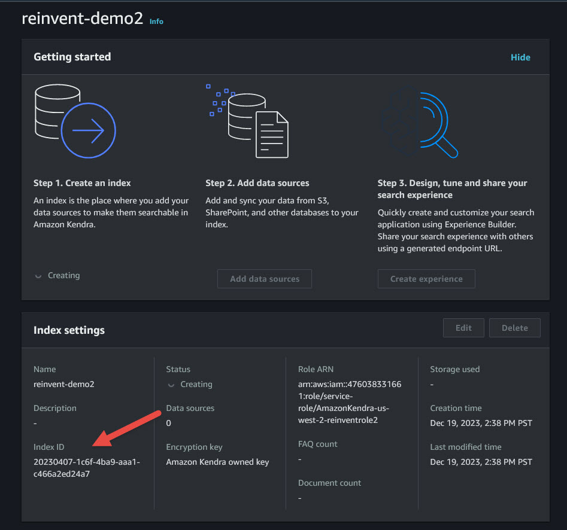
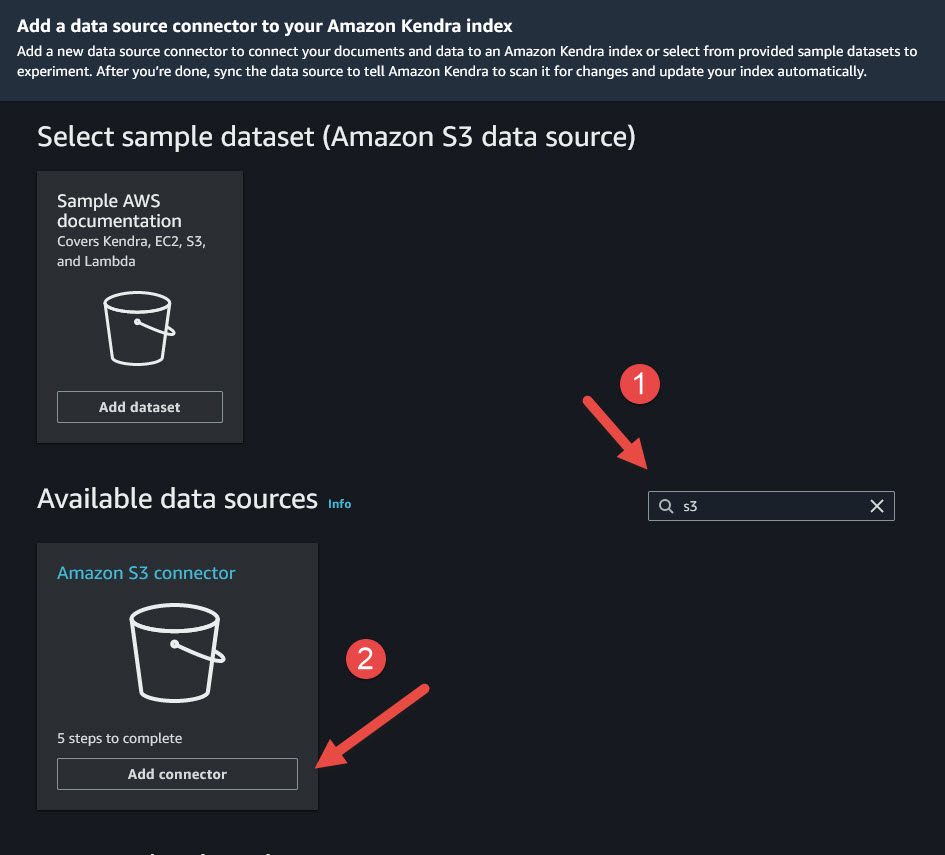
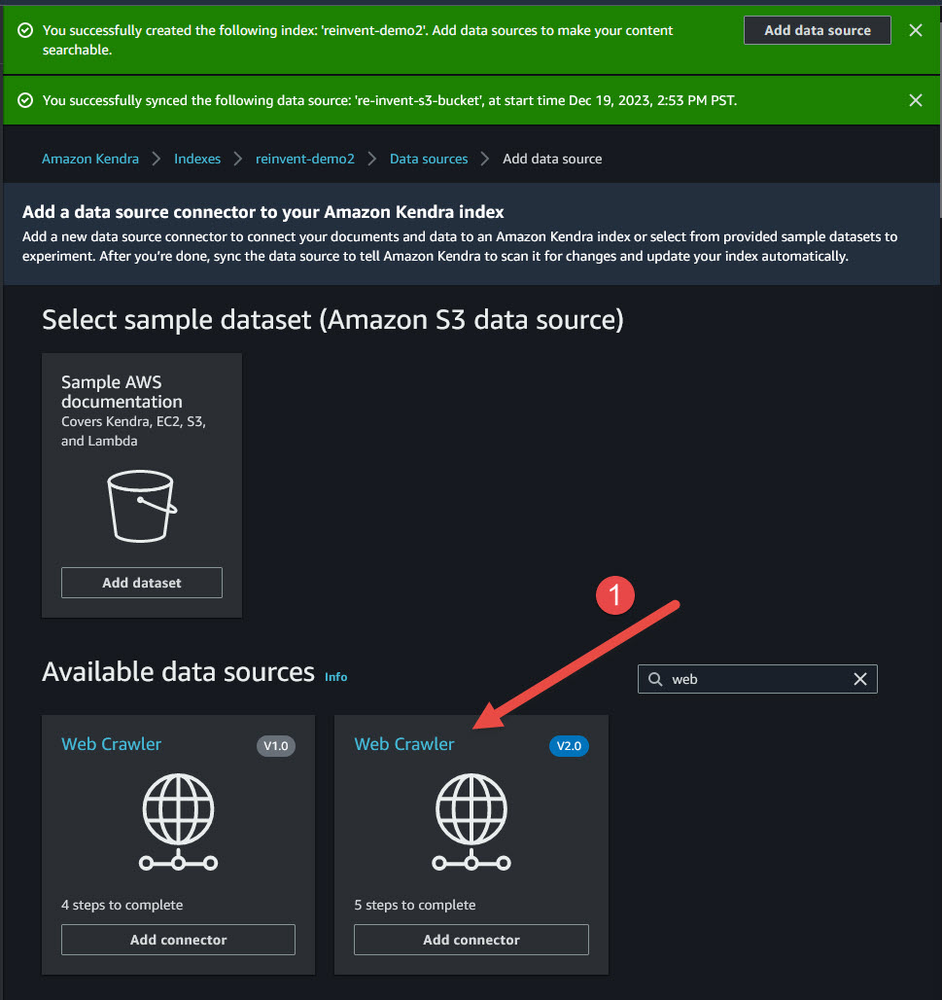
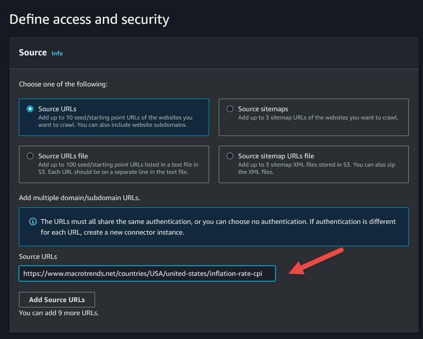
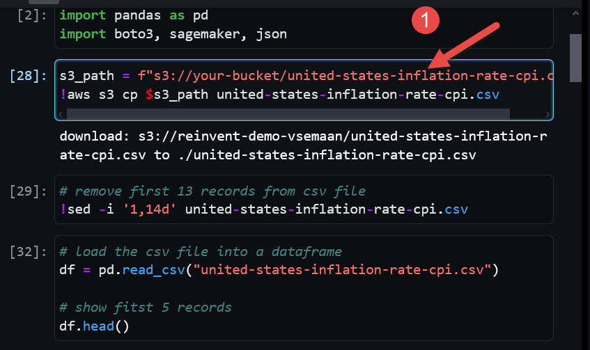
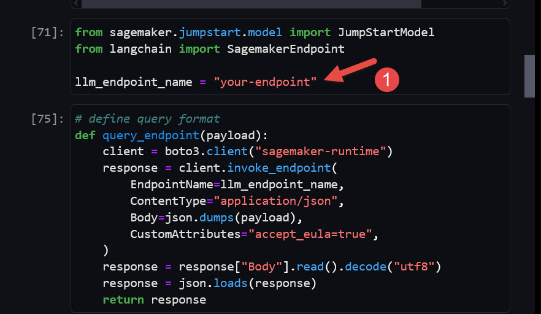

# Demos for Unlock insights with AWS GenAI services (re:Invent BOA303)

This repository is complementary to breakout session on "BOA303 - Unlock insights with AWS GenAI services" at [re:Invent 2023](https://reinvent.awsevents.com/)

🎥 Watch the session [here](https://bit.ly/BOA303-reinvent-23)

In these demos, you will explore how RAG ( Retrieval-Augmented Generation ) can enhance AI models by leveraging external data sources to provide context-aware answers and unlock insights.

Learn 2 ways to use your data with GenAI models:

1️⃣ DEMO 1: [Deploying Llama2 with Sagemaker, CodeWhisperer + Kendra for data retrieval](#demo-1---rag-approach-with-amazon-kendra)

2️⃣ DEMO 2: [Using Claude 2 with Bedrock + Vector DB for data retrieval](#demo-2---rag-approach-with-vectordb)


## DEMO 1 - RAG approach with Amazon Kendra

### Prerequisites:

1. Follow [instructions](https://docs.aws.amazon.com/sagemaker/latest/dg/studio-updated-launch.html#studio-updated-launch-prereq) to setup Amazon SageMaker Studio prerequisites

2. Follow [instructions](https://docs.aws.amazon.com/codewhisperer/latest/userguide/sagemaker-setup.html) to enable Amazon CodeWhisperer extension for SageMaker Studio


### Setup for Demo 1

#### 1. Create S3 Bucket and download data

- Open Amazon S3 console. Click **Create a bucket**. Provide a unique name `reinvent-demo-yourname`. Keep other options as default. Click **Create bucket**. 
- Go to [https://www.macrotrends.net/countries/USA/united-states/inflation-rate-cpi](https://www.macrotrends.net/countries/USA/united-states/inflation-rate-cpi). Click **download historical data**.
- Download Starbucks annual report PDF.
- Upload downloaded csv and pdf files into S3 bucket.

#### 2. Amazon Kendra Index & data sources 

- Open Amazon Kendra console. Click **Create an index**. Provide index name. Under IAM Select **Create a new role (Recommended)**. Enter role name. Click **Next**, then **Next** in the follow-up screens, and Click **Create**.

<div align="center">
    
</div>


- Copy index name and save for future references. Wait for index to become active and click **Add data sources**.
- Find Amazon S3 Connector. Click **Add connector**. 

<div align="center">
    
</div>

- Provide Data Source name. Click **Next**. Create a new role or select an existing role.
- Click **Browse S3** and select the bucket that you created in Step 1. At the bottom select **Frequency Run on demand**. Click **Next**, then **Next** again then **Add data resources**.

<div align="center">
    
</div>

- Once the data source is created, click **Sync Now** button at the top.
- Let’s add one more data source. Click on **Data sources** on the left pane then click **Add data source**. Search for Web and pick **Web Crawler V2.0**.

<div align="center">
    
</div>

- Provide data source name and click **Next**. Copy URL from step 1 into **Source URLs**. Select **Create a new role (Recommended)** at the bottom, type name, and click **Next**. 

<div align="center">
    
</div>

- Keep default options and select Frequency **Run on demand**. Click **Next**, then **Next** again then **Add data resources**.
- Once the data source is created, click **Sync Now** button at the top.


#### Demo 1 - Part 1: Notebook updates

1. Open SageMaker Studio and copy `Demo1 - RAG with SageMaker and Kendra.ipynb` notebook.

2. Install dependencies as needed

   ```bash
   !pip install —upgrade —quiet sagemaker
   !pip install langchain


3. Update s3_path with path to your bucket created in prerequisites. Update if needed csv file name

<div align="center">
    
</div>


#### Demo 1 -  Part 2: Notebook updates

1. Copy your SageMaker Endpoint and replace in the code. In SageMaker Console, go to Sidebar > Home > Deployment dropdown > Endpoints — copy the name of the LLM and paste in the 3rd row below

<div align="center">
    
</div>


#### Demo 1 - Part 3: Notebook updates

1. Update Kendra IndexID in the code and AWS region.


Run your notebook and ask questions!


## DEMO 2 - RAG approach with VectorDB 
